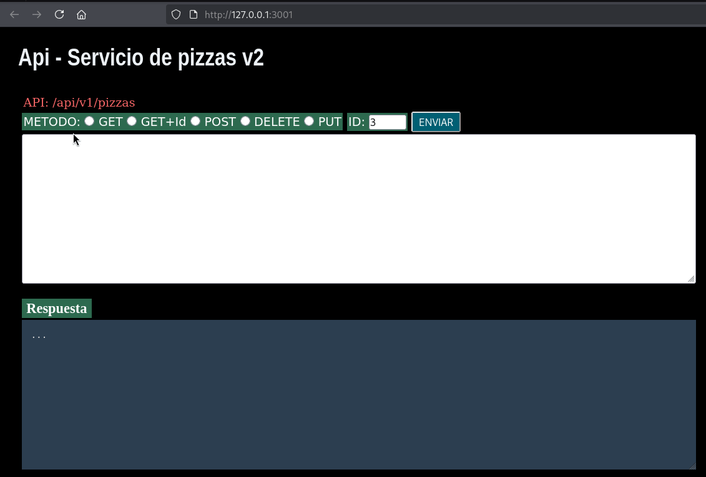

# Api de Pizzas (V2)

API  desarrollada con Node.js y Express. Permite consultar, agregar, actualizar y eliminar pizzas mediante diferentes métodos HTTP.

Instalacion y ejecucion:
```bash
git clone <repo>
cd backend-playground/Tareas_TEP1/02-ApiServicioPizzasV2
npm install
npm run dev
```


# Metodos disponibles

### GET

Endpoints usados:

- Sin id: `/api/v1/pizzas`
- Con id: `/api/v1/pizzas/<idNumerico>`



### POST

En desarroyo...

### DELETE

En desarroyo...

### PUT

En desarroyo...